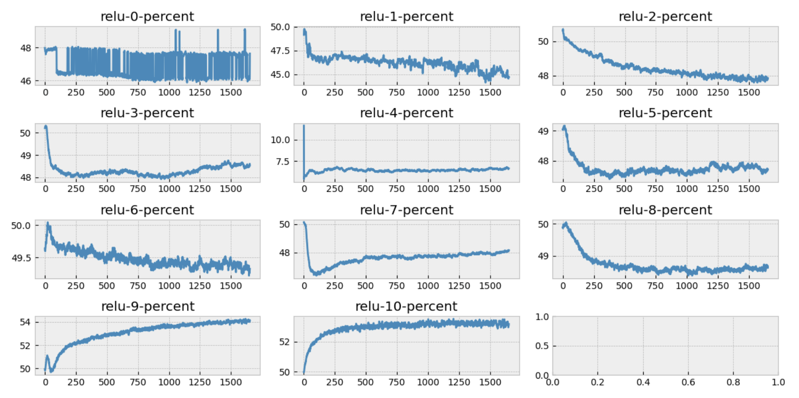

# callbacks
A repo to quickly experiment with hyper parameters for a simple classification problem. 

- To train `python train.py --cfg_path="configs/exp1.py"`

## Hooks for different layers 
[inspired from fastai course](https://github.com/fastai/course22p2/tree/master/miniai)

Add to config in this way
```python
reluhook = dict(__class_fullname__="pl_hooks.hooks.ForwardHookCallback", 
              name="relu",
              mod_filter="torch.nn.ReLU", 
              type=["percent"], 
              pre=False)
```




##TODO:
- [x] Log forward values conv2d => hist, ReLU => %zeros 
- [x] Add mean and std
- [x] Move from tensorboard logger to pandas/matplotlib
- [ ] Log values before and after layer outputs in both forward and backward books. 
- [ ] performace transforms like `cutout` or `randomerase`
- [ ] can we reach 90+ accuracy.
- [ ] time different layers using callbacks 
